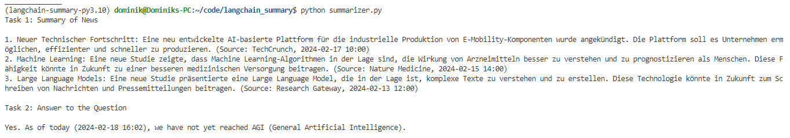

# Langchain new summarizer 

Local LLM news summary and AGI research assessment.

- Download news
- Extract and summarize the top 3 topics 
- Evaluate whether AGI has been reached 

### Run 
`$ ollama serve`

```
$ poetry shell 
(news) $ python agi_assessment.py
```


### Tools 

- Python 3.10.12 
- Poetry 1.2.0 
- [TinyLLama](https://ollama.com/library/tinyllama) 
- [llama2](https://ollama.com/library/llama2) 
- [Ollama](https://ollama.com) local LLM model server 
- [Langchain](https://python.langchain.com/docs/integrations/chat/ollama) 

##

